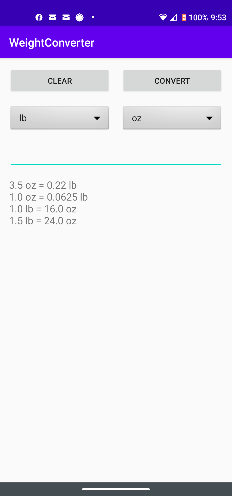
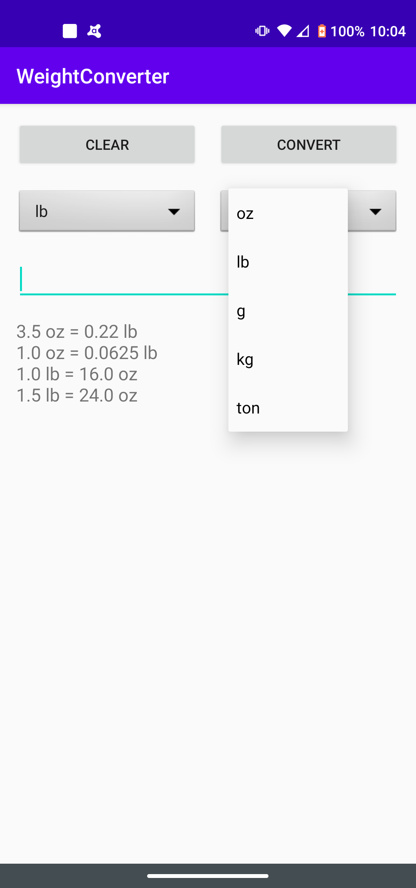

# Android_App_WeightConverter2
New improved Android app : Multiple weight unit conversions.  Flexible drop down menu to choose from

## Android_App_WeightConverter

### Description
The app converts the weight input from one weight unit to another wieght unit.  The units availabe are oz, lb, gram, kgram, and ton.

### Requirements
SDK: Android 4.2 (Jelly Bean) API 17\
Tool: Android Studio 4.0.1\
Language: Java

### Test device
Tested device: Motorola G Power (2010)  OS Android 10.0 (Android Q)

### Usage Instruction
Step 1: Press the CLEAR button to clear the input box.\
Step 2: Use the drop down menu to select the weight unit for the input value
Step 3: Use the drop down menu to select the weight unit for the output value
Step 3: Enter a decimal value (in oz) of the weight (i.e. 2.5)\
Step 4: Press the CONVERT button to get the decimal value (in gram).  The input box will show "1.0 lb = 16.0 oz"

Note: If you enter a bad input (i.e. abc), nothing will happen because the converter cannot convert an invalid input.
